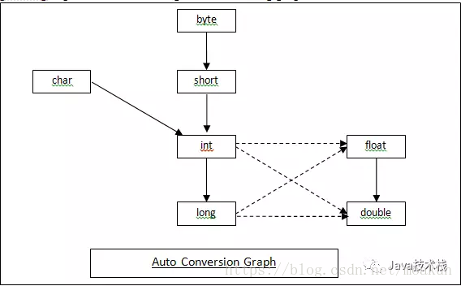
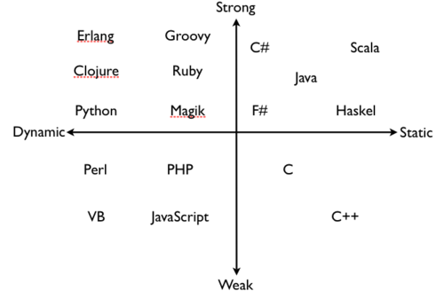

# 数据类型和运算符
任何程序设计语言的基础都是数据类型和运算符。

Java 是静态类型、强类型的语言。

Java 的数据类型分为两大类：基本类型和对象类型。

## 基本类型
基本类型有八种：byte、short、int、long、char、boolean、float、double。
Java 的核心是八种基本类型。
基本类型，不是普通面向对象意义中的对象，而是普通的二进制值，这是出于效率考虑。
基本类型分类：
- 整型：byte、short、int、long、char，
- 布尔型：boolean；
- 浮点型：float、dobule。
整型中最常用int，浮点型中常用 double。
char 在 Java 语言规范中归类为整型，但它的主要目的是存储字符串，与其余四种整型的主要
用途截然不同。所以把它当作字符型讲解。

各类型长度：

| | |
|:- | -|
| boolean、byte |  8 bit
| char、short |   16 bit
| float、int |   32 bit
| double、long |  64 bit

### 整型
### 字符型
```java

char ch = 'x';
System.out.println(ch);
```

char 是16位无符号整型，所以可以做多种算术类型的运算。
```java
ch++; // 递增
System.out.println(ch);

ch = 90; // 给char类型的变量赋整型值
```
### 布尔型
布尔类型只有两个可取值：true/false。
```java
boolean b;
b = false;

b = true;
```
## 字面值
字面值（literal）也常常称为常量（constant）。

- 整型字面值：100，-100。没有小数部分。整型字面值默认为int类型。加后缀L即成为long类型 100L。
- 字符字面值：'x'，单引号括起来的单个字符或者转义字符序列。
- 浮点字面值：103.14, 1.0314e2，-103.14, 100., .123, 3e10, 1024f, 800d。含有小数点的数值、或者科学计数法、或者有浮点数类型后缀。
- 虽然字符串不是基本类型，但介绍字符串字面值："hello"，""，双引号括起来的任意字符序列（包括零个）。

数值字面值中可以使用下划线。

整型字面值还支持其它进制。
- 二进制字面值：0b100，0B100
- 八进制字面值：0177
- 十六进制字面值：0x10，0X10

浮点数支持十六进制字面值。
- ??

字符和字符串中的转义序列是一致的，包括这些：
`\b \t \n \r \f \' \" \\ \ddd \uhhhh`

## 变量
变量，是可以被赋值的已命名的内存位置。（是指定了名称的一块内存空间）。

变量声明语法： type var;

变量初始化：变量在使用之前必须先赋值，这一步叫初始化。变量初始化可以在声明时初始化，
也可以在声明后单独赋值。
```java
// 声明时直接赋初值
type var = value;
// 先声明，再赋初值
type var;
var  = value;
```

可以一次性声明多个变量，用逗号分隔。

```java
int a, b = 4, d, e;
```
## 变量的作用域和生命周期
代码块：花括号定义了代码块，代码块以左括号开始，以右括号结束。

代码块定义了作用，每次创建新的代码块时，就同时创建了新的作用域。

最常用的是类作用域和方法作用域。

方法作用域从方法定义的左花括号开始，到右花括号结束，如果定义了形参，则形参也属于方法
作用域。方法定义的这个代码块也叫方法体。

- 作用域的基本规则：在作用域内声明的变量，在作用域之外是不可见的（也就是不可访问）。
  正是作用域规则提供了封装的基础。
- 代码块可以嵌套。内层作用域可以访问外层作用域的变量，外层作用域不可以访问内层作用域
  的变量。
- 可以在代码块的任何位置声明变量，但只有在声明之后才可见。
- 变量在进入作用域时创建，在离开作用域时销毁。
- Java 有个特殊规则：方法体中，内层作用域不可以声明与外层作用域同名的变量，否则编译报错。

## 运算符
- 算数运算符：+ - * / %
- 关系运算符：> >= < <= == !=
- 逻辑运算符：! & ^ |  && ||
- 赋值运算符：=
- 速记赋值运算符： op=，其中 op 可以是任何二元运算符。
  `var op= val;` 等效于 `var = var op val`;

还有其他运算符：成员运算符、方法调用运算符、类型转换、三目、逗号、instanceof

&& 和 || 有短路效应。Java 规范中把这俩叫做条件与、条件或。但大家都叫“短路与”和“短路或”。
## 赋值中的类型转换
将一种类型的数据赋值给另一种类型的变量时，会先将等号右侧的数据转换为等号左侧的变量
的类型之后再赋值。然而 Java 有严格的类型检查，故而不是所有到转换都是兼容的。

类型转换分为自动类型转换和强制类型转换两种。另一个角度分为隐式类型转换和显式类型转换。


可以发生自动类型转换的如图所示：

图中，实线表示自动转换时不会造成数据丢失，虚线则可能会出现数据丢失问题。

- boolean 和数值类型不兼容，不可以互相赋值。强制类型转换也办不到。
- int 类型的**常量**直接赋值给byte、short、char类型的变量，当数值范围不超出左侧类型的表示范围时，可以发生自动类型转换。
```java

byte a = 3; // 可以
byte b = 128; // 报错，超出
byte c = (byte)128; // 可以通过编译，但 c 的实际取值会变成 -1，因为溢出了

int a = 1;
byte d = a; // 不可以，只有int常量才行
```

- short 和 char 之间互不兼容，必须强制类型转换才能赋值

## 表达式中的类型转换
不同数值类型出现在同一个表达式中，会出现类型提升：
1. 所有低于int的都转为 int
2. 如果有高于int的，向最高的看齐

```java
short s1 = 1, s2 = 2;
s1 + s2; // 结果是int类型，因为先提升为int

byte b1 = 2, b2 = 3;
byte b3 = (byte)(b1 + b2);// 这里必须强转，否则编译报错
```
## 附：静态类型/动态类型；强类型/弱类型
唉，看完这些，更不会区分动静态类型了。

粗糙的理解：变量有固定的类型，是静态类型，如java、c声明变量时都要指定具体的类型；
变量没有固定的类型，就是动态类型，比如Python、JavaScript，声明变量时不需要指定
具体的类型，之后可以赋给任何类型的值。



***
[ 弱类型、强类型、动态类型、静态类型语言的区别是什么？ - 知乎](https://www.zhihu.com/question/19918532)

Program Errors
- trapped errors。导致程序终止执行，如除0，Java中数组越界访问
- untrapped errors。 出错后继续执行，但可能出现任意行为。如C里的缓冲区溢出、Jump到错误地址

- Forbidden Behaviours   语言设计时，可以定义一组forbidden behaviors. 它必须包括所有untrapped errors,
  但可能包含trapped errors.

Well behaved、ill behaved
- well behaved: 如果程序执行不可能出现forbidden behaviors, 则为well behaved。
- ill behaved: 否则为ill behaved...

2. 有了上面的概念，再讨论强、弱类型，静态、动态类型

- 强、弱类型强类型
  - 强类型 strongly typed: 如果一种语言的所有程序都是well behaved——即不可能出现
    forbidden behaviors，则该语言为strongly typed。
  - 弱类型 weakly typed: 否则为weakly typed

  比如C语言的缓冲区溢出，属于 untrapped errors，即属于forbidden behaviors..故C是弱类型。

  弱类型语言，类型检查更不严格，如偏向于容忍隐式类型转换。譬如说C语言的int可以变成double。
  这样的结果是：容易产生forbidden behaviours，所以是弱类型的。

- 动态、静态类型静态类型
  - statically: 如果在编译时拒绝ill behaved程序，则是statically typed;
    Q. C 是静态类型语言，但编写一个缓冲区溢出的程序并不会在编译时被拒绝。
      ps: 缓冲区溢出是 forbidden error，所以是 ill behaved。
  - 动态类型dynamiclly: 如果在运行时拒绝ill behaviors, 则是dynamiclly typed。

3. 误区

大家觉得C语言要写int a, int b之类的，Python不用写(可以直接写a, b)，所以C是静态，Python是动态。
这么理解是不够准确的。譬如Ocaml是静态类型的，但是也可以不用明确地写出来。。

另一回答者说：
> 静态类型、动态类型大家应该明白其实是指的Type Check发生的时机。
> 而强类型、弱类型到底是什么意思呢？其实这些词语本身概念就是模糊不清的，反正我是能避免使用就尽量避免使用。
